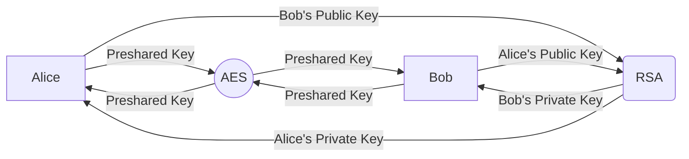

# Cyber Security

This repository mainly consists of exploits in the form of `Python` scripts and a bunch of `PDF` documentation, indicating instructions and results. For instance, **E2E Messenger** implements the following schema:

Graphical demonstration of (a)symmetric encryption:
